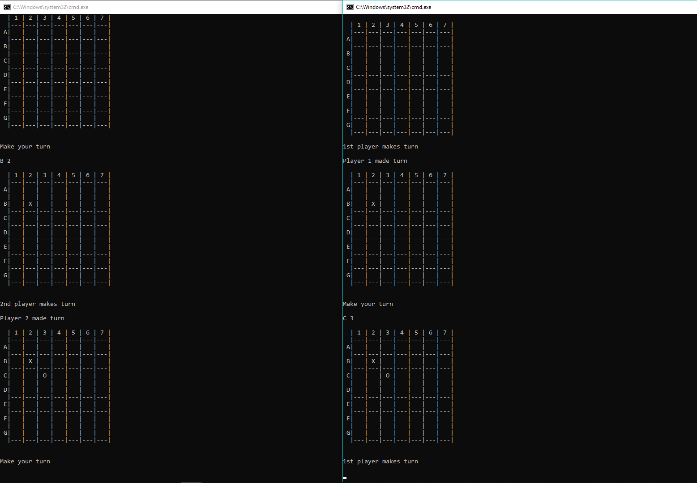

**About**

This program has client and server versions and allows you to play tic-tac-toe with grid size from 3 to 26.

**Usage**

First of all, you need to run server. Make sure that you run server and client on machines, which can be connected through network.

To run server:

`python -m server host port grid_size`

where host, port and grid_size are variables you define.

To run client:

`python -m client host port`

where you use same host and port that you used for server.

**Run tests**

```
python server/run_before_tests.py
pytest -vv --cov=server tests/
pytest -vv --cov=client tests/
```

**Run linters**

`flake8`

**Run autoformat**

`isort --apply --recursive server/ client/ tests/`

`black --py36 server/ client/ tests/`

**Example**

